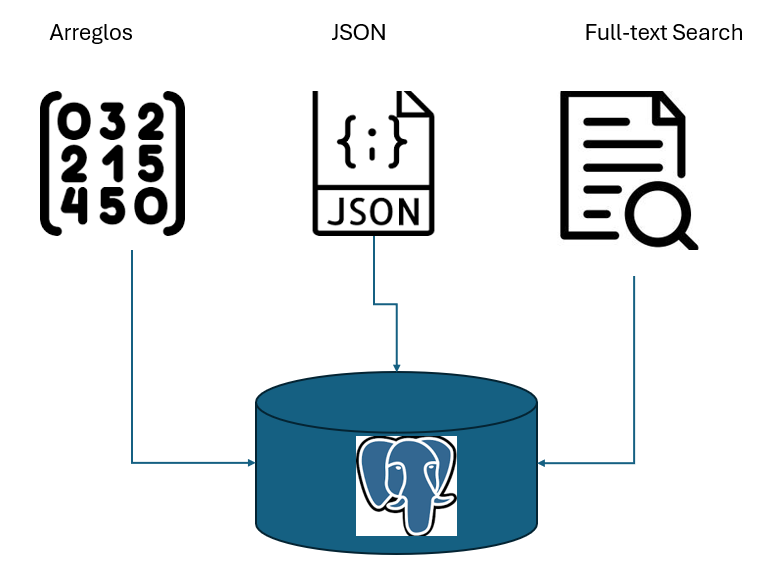

# Creación, uso y búsquedas de campos tipo arreglo, json y full-text search

## Objetivo de la práctica:
Al finalizar la práctica, serás capaz de:
- Comprender cómo crear y trabajar con los tipos de datos: arreglos, JSON y texto completo.
- Aprender a insertar y manipular datos almacenados en campos de tipo arreglo, JSON y texto completo.
- Realizar consultas avanzadas para buscar información específica en estos tipos de campos
- Implementar índices adecuados, como GIN, para mejorar el rendimiento de las consultas en campos con grandes volúmenes de datos.
## Objetivo Visual 
Crear un diagrama o imagen que resuma las actividades a realizar, un ejemplo es la siguiente imagen. 



## Duración aproximada:
- 30 minutos.

## Tabla de ayuda:

## Instrucciones 
<!-- Proporciona pasos detallados sobre cómo configurar y administrar sistemas, implementar soluciones de software, realizar pruebas de seguridad, o cualquier otro escenario práctico relevante para el campo de la tecnología de la información -->
### Tarea 1. Creación, Uso y Búsqueda en Campos de Tipo Arreglo
Paso 1. Ingresar a la base de datos del curso usando psql.
```shell
psql -d curso
```

Paso 2. Crear una tabla con un campo tipo arreglo:
```shell
CREATE TABLE productos (
    id SERIAL PRIMARY KEY,
    nombre VARCHAR(50),
    categorias TEXT[]
);
```

Paso 3. Insertar registros en la tabla:
```shell
INSERT INTO productos (nombre, categorias) VALUES 
('Laptop', ARRAY['Electrónica', 'Computadoras']),
('Teléfono', ARRAY['Electrónica', 'Móviles']),
('Silla', ARRAY['Muebles', 'Oficina']);
```

Paso 4. Realizar una búsqueda en base a un valor dentro del arreglo:
```shell
SELECT * FROM productos
WHERE 'Electrónica' = ANY (categorias);
```


### Tarea 2. Creación, Uso y Búsqueda en Campos Tipo JSON
Paso 1. Crear una tabla con un campo tipo JSON:
```shell
CREATE TABLE pedidos (
    id SERIAL PRIMARY KEY,
    cliente JSON
);
```

Paso 2. Insertar registros en la tabla.
```shell
INSERT INTO pedidos (cliente) VALUES 
('{"nombre": "Juan", "direccion": "Calle 123", "telefono": "123456789"}'),
('{"nombre": "Ana", "direccion": "Avenida 456", "telefono": "987654321"}');
```

Paso 3. Realizar una consulta para obtener el nombre del cliente.
```shell
SELECT cliente->>'nombre' AS nombre_cliente FROM pedidos;
```

### Tarea 3. Creación, Uso y Búsqueda con Full-Text Search
Paso 1. Crear una tabla con un campo de tipo texto:
```shell
CREATE TABLE articulos (
    id SERIAL PRIMARY KEY,
    titulo TEXT,
    contenido TEXT
);
```
Paso 2. Insertar registros en la tabla:
```shell
INSERT INTO articulos (titulo, contenido) VALUES 
('PostgreSQL Tutorial', 'Aprende cómo usar PostgreSQL con ejemplos prácticos.'),
('Introducción a Bases de Datos', 'Este artículo introduce conceptos básicos de bases de datos relacionales.'),
('Full-Text Search en PostgreSQL', 'Full-text search permite realizar búsquedas avanzadas en campos de texto.');
```
Paso 3. Crear un índice de full-text search y realizar una búsqueda.
```shell
CREATE INDEX idx_articulos_contenido ON articulos USING gin(to_tsvector('spanish', contenido));

SELECT * FROM articulos
WHERE to_tsvector('spanish', contenido) @@ to_tsquery('PostgreSQL');
```


### Resultados esperados
Tarea 1.
```shell
curso=> SELECT * FROM productos
WHERE 'Electrónica' = ANY (categorias);
 id |  nombre  |         categorias
----+----------+----------------------------
  1 | Laptop   | {Electrónica,Computadoras}
  2 | Teléfono | {Electrónica,Móviles}
(2 rows)
```
Tarea 2.
```shell
curso=> SELECT cliente->>'nombre' AS nombre_cliente FROM pedidos;
 nombre_cliente
----------------
 Juan
 Ana
(2 rows)
```
Tarea 3.
```shell
curso=> SELECT * FROM articulos
WHERE to_tsvector('spanish', contenido) @@ to_tsquery('PostgreSQL');
 id |       titulo        |                                      contenido
----+---------------------+--------------------------------------------------------------------------------------
  1 | Guía de PostgreSQL  | Este artículo proporciona una guía sobre PostgreSQL y sus características avanzadas.
  3 | PostgreSQL Tutorial | Aprende cómo usar PostgreSQL con ejemplos prácticos.
(2 rows)
```