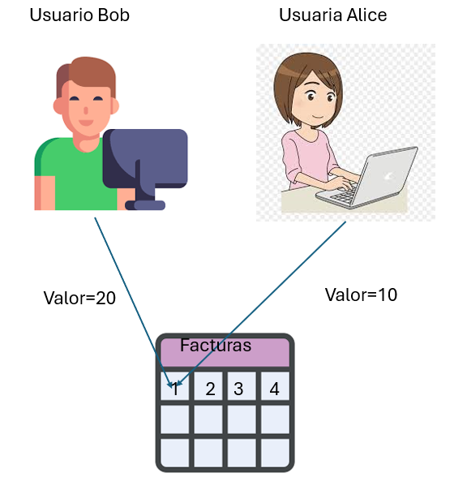

# Manejo de transacciones y commit de dos fases.

## Objetivo de la práctica:
Al finalizar la práctica, serás capaz de:
- Comprender y aplicar el manejo de transacciones en PostgreSQL para garantizar la consistencia y el aislamiento de los datos.
- Aprender a usar transacciones con BEGIN, COMMIT, y ROLLBACK para realizar operaciones seguras.
- Entender el commit de dos fases (Two-Phase Commit) para coordinar transacciones distribuidas y garantizar la integridad en operaciones complejas.
- Practicar cómo preparar (PREPARE TRANSACTION), confirmar (COMMIT PREPARED), y revertir (ROLLBACK PREPARED) transacciones para el manejo de datos distribuidos.
## Objetivo Visual 
Crear un diagrama o imagen que resuma las actividades a realizar, se muestra un ejemplo en la siguiente imagen: 



## Duración aproximada:
- 30 minutos.

## Tabla de ayuda:

## Instrucciones 
<!-- Proporciona pasos detallados sobre cómo configurar y administrar sistemas, implementar soluciones de software, realizar pruebas de seguridad, o cualquier otro escenario práctico relevante para el campo de la tecnología de la información -->
### Tarea 1. Simular dos transacciones simultáneas que modifican un mismo registro.

Paso 1.  Crear una sesión psql y establecer el prompt con el nombre "ALICE"
```shell
psql curso 
\set PROMPT1 'ALICE> '
```
Paso 2.  Crear otra sesión o ventana de psql y establecer el prompt con el nombre "BOB"
```shell
psql curso
\set PROMPT1 'BOB> '
```

Paso 2. Crear una tabla llamada mvcc_lab con los siguientes campos: id integer, valor integer.
```shell 
BOB> CREATE TABLE mvcc_lab ( id integer, valor integer);
```

Paso 3. Añadir datos de prueba a la tabla recien creada.
```shell 
BOB> INSERT INTO mvcc_lab SELECT a,a from generate_series(1,10) as a;
```

Paso 4. Iniciar una transacción en la ventana ALICE que actualice el registro con id=1 al valor 10 de la tabla mvcc_lab
```shell 
ALICE> BEGIN;
ALICE> UPDATE mvcc_lab SET valor=10 WHERE id=1;
UPDATE 1
ALICE>
```
Paso 5. Iniciar una transacción en la ventana BOB que actualice el registro con id=1 al valor 20 de la tabla mvcc_lab
```shell 
BOB> BEGIN;
BOB> UPDATE mvcc_lab SET valor=20 WHERE id=1;
_(esperando...)
```
Paso 6. Confirme la transacción de la terminal ALICE y consulte el valor del registro con id = 1
```shell 
ALICE> COMMIT;
ALICE> SELECT valor FROM mvcc_lab WHERE id=1;
 valor
-------
 10
(1 fila)
```
Paso 7. Consulte el valor del registro id=1 en la terminal BOB
```shell 
BOB> SELECT valor FROM mvcc_lab WHERE id=1;
 valor
-------
 20
(1 fila)
```
Paso 8. Confirme la transacción en la terminal BOB y consulte el valor del registro en la terminal ALICE
```shell 
UPDATE 1 -- Mensaje cuando ALICE confirmó transaccion
BOB>COMMIT;
ALICE>SELECT valor FROM mvcc_lab WHERE id=1;
 valor
-------
 20
(1 fila)

```

### Tarea 2. Commit de Dos Fases (Two-Phase Commit)
Paso 1. Crear dos tablas llamadas ordenes y pagos:
```shell
CREATE TABLE ordenes (
    id SERIAL PRIMARY KEY,
    descripcion VARCHAR(100),
    estado VARCHAR(20)
);

CREATE TABLE pagos (
    id SERIAL PRIMARY KEY,
    orden_id INT,
    monto NUMERIC,
    estado VARCHAR(20)
);

```
Paso 2. Insertar registros en las tablas.
```shell
INSERT INTO ordenes (descripcion, estado) VALUES 
('Orden 1', 'pendiente');

INSERT INTO pagos (orden_id, monto, estado) VALUES 
(1, 100, 'pendiente');

```

Paso 3. Utilizar un commit de dos fases para actualizar ambas tablas de forma coordinada
```shell
BEGIN;

UPDATE ordenes SET estado = 'completada' WHERE id = 1;
UPDATE pagos SET estado = 'completado' WHERE orden_id = 1;

-- Preparar la transacción para el commit de dos fases
PREPARE TRANSACTION 'transaccion_orden_pago';

-- Confirmar la transacción en la fase final
COMMIT PREPARED 'transaccion_orden_pago';

```

### Resultado esperado
Tarea 1.
```shell
 valor
-------
 20
(1 fila)

```
Tarea 2.
```shell
curso=> commit prepared 'transaccion_orden_pago';
COMMIT PREPARED
```

