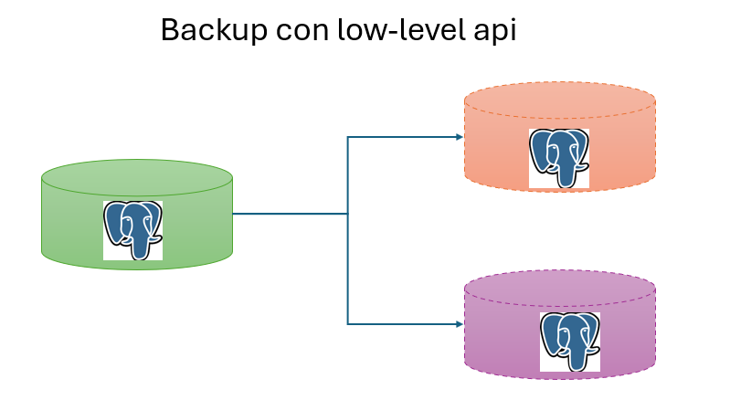

# Respaldo con API de bajo nivel y Autovacuum 

## Objetivo de la práctica:
Al finalizar la práctica, serás capaz de:
- Aprender a utilizar la API de bajo nivel para implementar respaldos de bases de datos.
- Entender el funcionamiento del autovacuum en una base de datos.

## Objetivo Visual: 
Crear un diagrama o imagen que resuma las actividades a realizar, se muestra un ejemplo en la siguiente imagen: 



## Duración aproximada:
- 30 minutos.

## Tabla de ayuda:

## Instrucciones: 
<!-- Proporciona pasos detallados sobre cómo configurar y administrar sistemas, implementar soluciones de software, realizar pruebas de seguridad, o cualquier otro escenario práctico relevante para el campo de la tecnología de la información -->
### Tarea 1. Realizar un backup de la base de datos usando la API de bajo nivel de Postgresql
Paso 1. Iniciar una sesión psql y ejecutar el comando de inicio de backup:
```shell
psql -d curso
SELECT pg_start_backup('backup1', false); 
```

Paso 2. Copiar el directorio de datos a un directorio separado llamado /var/lib/postgresql/backup1 usando rsync:
```shell
 rsync -av --progress --exclude='postmaster.pid' --exclude='pg_wal/*' /var/lib/postgresql/14/main/ /var/lib/postgresql/backup1/
```


Paso 3. Terminar el backup usando el comando pg_backup_stop:
```shell
SELECT * FROM pg_stop_backup(); --por defecto espera hasta que el último segmento wal haya sido guardado.
```


### Tarea 2. Observar el funcionamiento de autovacuum en la base de datos
Paso 1. Revisar la configuración actual de autovacuum:
```shell
SHOW autovacuum;
SHOW autovacuum_vacuum_threshold;
SHOW autovacuum_analyze_threshold;
SHOW autovacuum_vacuum_scale_factor;
SHOW autovacuum_analyze_scale_factor;
```

Paso 2. Crear una tabla de prueba y llenarla con datos:
```shell
CREATE TABLE test_autovacuum (id serial PRIMARY KEY, data text);
INSERT INTO test_autovacuum (data)
SELECT md5(random()::text) FROM generate_series(1, 1000000);
```

Paso 3. Observar las estadísticas de la tabla:
```shell
SELECT relname, n_live_tup, n_dead_tup, last_vacuum, last_autovacuum 
FROM pg_stat_user_tables 
WHERE relname = 'test_autovacuum';
```
Paso 4. Realizar operaciones de actualización y eliminación:
```shell
UPDATE test_autovacuum SET data = md5(random()::text) WHERE id % 2 = 0;
DELETE FROM test_autovacuum WHERE id % 3 = 0;
```
Paso 5. Revisar nuevamente las estadísticas de la tabla y revisar si se ejecutó el autovacuum:
```shell
SELECT relname, n_live_tup, n_dead_tup, last_vacuum, last_autovacuum 
FROM pg_stat_user_tables 
WHERE relname = 'test_autovacuum';
```


### Resultado esperado:
Tarea 2.
```shell
curso=> SELECT relname, n_live_tup, n_dead_tup, last_vacuum, last_autovacuum
FROM pg_stat_user_tables
WHERE relname = 'test_autovacuum';
     relname     | n_live_tup | n_dead_tup | last_vacuum |        last_autovacuum
-----------------+------------+------------+-------------+-------------------------------
 test_autovacuum |     666667 |          0 |             | 2024-10-06 19:00:44.756802-05
(1 row)
```
