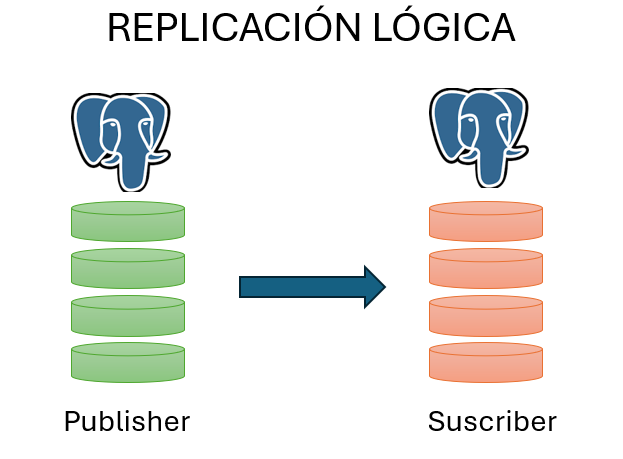

# Replicación lógica y particionamiento de tablas

## Objetivo de la práctica:
Al finalizar la práctica, serás capaz de:
- Configurar y mantener un sistema de replicación lógica en PostgreSQL.
- Diseñar e implementar estrategias efectivas de particionamiento de tablas.
## Objetivo Visual 



## Duración aproximada:
- 30 minutos.

## Tabla de ayuda:

## Instrucciones 
<!-- Proporciona pasos detallados sobre cómo configurar y administrar sistemas, implementar soluciones de software, realizar pruebas de seguridad, o cualquier otro escenario práctico relevante para el campo de la tecnología de la información -->
### Tarea 1. Realizar la replicación lógica de una tabla entre dos instancias de postgresql.

Paso 1. Crear el usuario replicator con permisos de replicacion en la instancia principal.
```shell
CREATE USER replicator WITH replication password 'curso2024';
```
Paso 2. Habilitar el la comunicación de las instancias a través de la red en el archivo pg_hba.conf
```shell
vi /etc/postgresql/14/main/pg_hba.conf
host    all             all             [ip_servidor]/32            scram-sha-256
```

Paso 3. Habilitar la replicación lógica en la instancia principal (puerto 5432) y reiniciar el servicio de la instancia principal.
```shell
vi /etc/postgresql/14/main/postgresql.conf
wal_level = logical;
```
```shell
service postgresql@14-main restart
```

Paso 4. Crear la tabla que se va a publicar en la instancia principal y dar todos los permisos al usuario replicador sobre la misma.
```shell
CREATE TABLE datos_replicados (id serial PRIMARY KEY, dato text);
GRANT ALL ON datos_replicados to replicator;
```

Paso 5. Crear la publicación.
```shell
CREATE PUBLICATION mi_publicacion FOR TABLE datos_replicados;
```


Paso 6. Crear una nueva instancia de Postgresql. Entrar como usuario postgres
```shell
pg_createcluster 14 replica
service postgresql@14-replica start
```
Revisar que las dos instancias estén activas:
```shell
postgres@curso:~$ pg_lsclusters
Ver Cluster Port Status Owner    Data directory                 Log file
14  main    5432 online postgres /var/lib/postgresql/14/main    /var/log/postgresql/postgresql-14-main.log
14  replica 5433 online postgres /var/lib/postgresql/14/replica /var/log/postgresql/postgresql-14-replica.log
```

Paso 7. Crear la base de datos curso_replica en la instancia réplica.
```shell
psql -p 5433
create database curso_replica;
```

Paso 8. Crear la tabla datos_replicados en la instancia replica.
```shell
CREATE TABLE datos_replicados (id serial PRIMARY KEY, dato text);
```

Paso 9. Crear la suscripción en la instancia réplica:
```shell
 CREATE SUBSCRIPTION mi_suscripcion
CONNECTION 'host=[ip_servidor] port=5432 dbname=curso user=replicator password=curso2024'
PUBLICATION mi_publicacion;
```

Paso 10. Insertar datos en la tabla datos_replicados en la instancia principal y revisar sus cambios en la instancia réplica.
```shell
-- En el publicador puerto 5432
INSERT INTO datos_replicados (dato) VALUES ('Dato de prueba');

-- En el suscriptor puerto 5433
SELECT * FROM datos_replicados;
```


### Resultado esperado
Los datos de la tabla deben ser los mismos en ambas instancias.