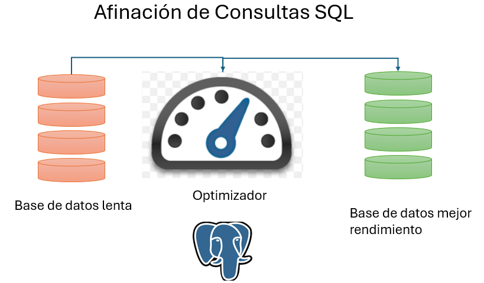

# Afinación de Consultas y Funciones

## Objetivo de la práctica:
Al finalizar la práctica, serás capaz de:
- Comprender y aplicar técnicas de afinación de consultas SQL en PostgreSQL.
- Desarrollar habilidades en el uso de herramientas de análisis de consultas como EXPLAIN y ANALYZE.
- Crear y optimizar funciones en PostgreSQL, incluyendo funciones escalares y de conjunto de filas.
- Practicar la escritura de funciones PL/pgSQL para lógica de negocio compleja.
## Objetivo Visual: 
Crear un diagrama o imagen que resuma las actividades a realizar, se muestra un ejemplo en la siguiente imagen: 



## Duración aproximada:
- 30 minutos.

## Tabla de ayuda:

## Instrucciones: 
<!-- Proporciona pasos detallados sobre cómo configurar y administrar sistemas, implementar soluciones de software, realizar pruebas de seguridad, o cualquier otro escenario práctico relevante para el campo de la tecnología de la información -->
### Tarea 1. Crear una consulta, analizar su rendimiento y realizar la optimización
Paso 1. Crear tablas de ejemplo con datos de prueba:
```shell
CREATE TABLE clientes (
    id_cliente SERIAL PRIMARY KEY,
    nombre VARCHAR(100),
    ciudad VARCHAR(50)
);

CREATE TABLE pedidos (
    id_pedido SERIAL PRIMARY KEY,
    id_cliente INT REFERENCES clientes(id_cliente),
    fecha_pedido DATE,
    monto DECIMAL(10,2)
);

-- Insertar datos de prueba
INSERT INTO clientes (nombre, ciudad)
SELECT 
    'Cliente ' || i,
    (ARRAY['Madrid', 'Barcelona', 'Valencia', 'Sevilla'])[1 + mod(i, 4)]
FROM generate_series(1, 100000) i;

INSERT INTO pedidos (id_cliente, fecha_pedido, monto)
SELECT 
    1 + mod(i, 100000),
    current_date - (random() * 365)::integer,
    (random() * 1000)::numeric(10,2)
FROM generate_series(1, 1000000) i;
```

Paso 2. Ejecutar una consulta inicial y analizar su rendimiento:
```shell

EXPLAIN ANALYZE
SELECT c.nombre, c.ciudad, COUNT(p.id_pedido) as num_pedidos, SUM(p.monto) as total_ventas
FROM clientes c
LEFT JOIN pedidos p ON c.id_cliente = p.id_cliente
WHERE p.fecha_pedido >= '2023-01-01'
GROUP BY c.id_cliente, c.nombre, c.ciudad
ORDER BY total_ventas DESC
LIMIT 10;
```

Paso 3. Crear índices para mejorar el rendimiento:
```shell
CREATE INDEX idx_pedidos_fecha ON pedidos(fecha_pedido);
CREATE INDEX idx_pedidos_cliente ON pedidos(id_cliente);
```

Paso 4. Volver a ejecutar la consulta y comparar el rendimiento:

Paso 5. Utilizar una subconsulta para optimizar aún más:
```shell
EXPLAIN ANALYZE
SELECT c.nombre, c.ciudad, p.num_pedidos, p.total_ventas
FROM clientes c
JOIN (
    SELECT id_cliente, COUNT(*) as num_pedidos, SUM(monto) as total_ventas
    FROM pedidos
    WHERE fecha_pedido >= '2023-01-01'
    GROUP BY id_cliente
) p ON c.id_cliente = p.id_cliente
ORDER BY p.total_ventas DESC
LIMIT 10;
```

Paso 6. Actualizar las estadísticas de la base de datos:
```shell
ANALYZE clientes;
ANALYZE pedidos;
```

Paso 7. Experimentar con diferentes estructuras de consulta y comparar los planes de ejecución:

### Resultado esperado:
El rendimiento de la consulta debió mejorar.

### Tarea 2. Crear funciones en postgresql

Paso 1. Crear una función escalar simple:
```shell
CREATE OR REPLACE FUNCTION calcular_descuento(precio NUMERIC, porcentaje NUMERIC)
RETURNS NUMERIC AS $$
BEGIN
    RETURN precio - (precio * porcentaje / 100);
END;
$$ LANGUAGE plpgsql;
```
```shell
-- Probar la función
SELECT calcular_descuento(100, 10);
```

Paso 2. Crear una función de conjunto de filas:
```shell
CREATE OR REPLACE FUNCTION obtener_top_clientes(fecha_inicio DATE, num_clientes INTEGER)
RETURNS TABLE (
    nombre VARCHAR,
    ciudad VARCHAR,
    total_ventas NUMERIC
) AS $$
BEGIN
    RETURN QUERY
    SELECT c.nombre, c.ciudad, SUM(p.monto) as total_ventas
    FROM clientes c
    JOIN pedidos p ON c.id_cliente = p.id_cliente
    WHERE p.fecha_pedido >= fecha_inicio
    GROUP BY c.id_cliente, c.nombre, c.ciudad
    ORDER BY total_ventas DESC
    LIMIT num_clientes;
END;
$$ LANGUAGE plpgsql;
```

```shell
-- Probar la función
SELECT * FROM obtener_top_clientes('2023-01-01', 5);
```
Paso 3. Crear una función con lógica condicional:
```shell
CREATE OR REPLACE FUNCTION categorizar_cliente(total_ventas NUMERIC)
RETURNS VARCHAR AS $$
BEGIN
    RETURN CASE
        WHEN total_ventas >= 10000 THEN 'Premium'
        WHEN total_ventas >= 5000 THEN 'Gold'
        WHEN total_ventas >= 1000 THEN 'Silver'
        ELSE 'Bronze'
    END;
END;
$$ LANGUAGE plpgsql;
```
```shell
-- Usar la función en una consulta
SELECT c.nombre, 
       SUM(p.monto) as total_ventas, 
       categorizar_cliente(SUM(p.monto)) as categoria
FROM clientes c
JOIN pedidos p ON c.id_cliente = p.id_cliente
GROUP BY c.id_cliente, c.nombre
ORDER BY total_ventas DESC
LIMIT 10;
```
Paso 4. Crear una función que utilice un cursor:
```shell
CREATE OR REPLACE FUNCTION procesar_pedidos_grandes()
RETURNS void AS $$
DECLARE
    pedido_record RECORD;
    cur_pedidos CURSOR FOR 
        SELECT id_pedido, monto
        FROM pedidos
        WHERE monto > 5000
        ORDER BY monto DESC;
BEGIN
    FOR pedido_record IN cur_pedidos LOOP
        RAISE NOTICE 'Procesando pedido %: % €', 
                     pedido_record.id_pedido, pedido_record.monto;
        -- Aquí iría la lógica de procesamiento
    END LOOP;
END;
$$ LANGUAGE plpgsql;
```
```shell
-- Ejecutar la función
SELECT procesar_pedidos_grandes();
```

Paso 5. Optimizar una función con RETURN QUERY:
```shell
CREATE OR REPLACE FUNCTION clientes_sin_pedidos()
RETURNS TABLE (id_cliente INT, nombre VARCHAR) AS $$
BEGIN
    RETURN QUERY
    SELECT c.id_cliente, c.nombre
    FROM clientes c
    LEFT JOIN pedidos p ON c.id_cliente = p.id_cliente
    WHERE p.id_pedido IS NULL;
END;
$$ LANGUAGE plpgsql;

-- Usar la función
SELECT * FROM clientes_sin_pedidos();
```
### Resultado esperado:
Las funciones se ejecutan sin errores.
